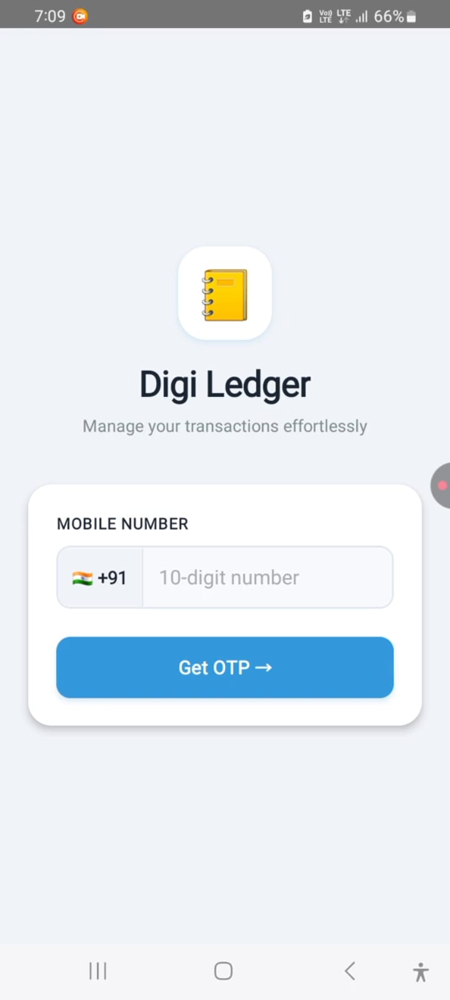
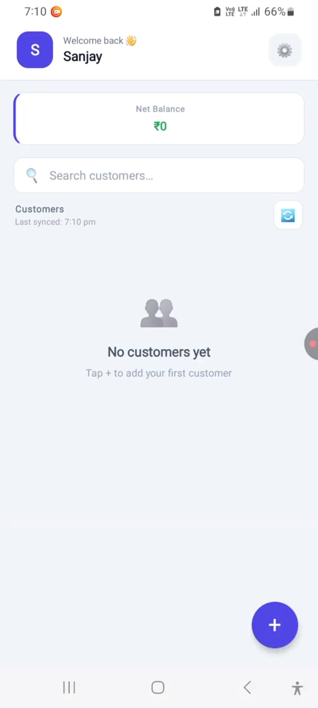
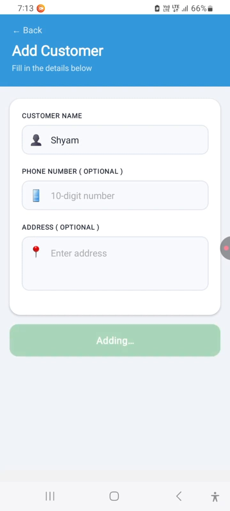
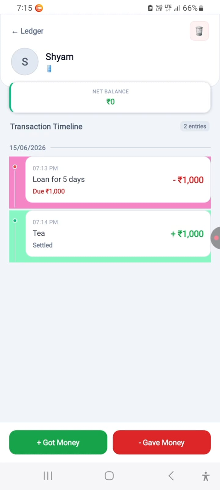
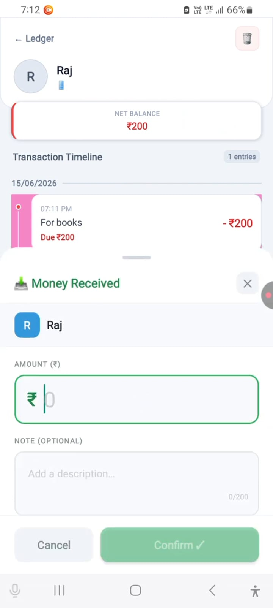
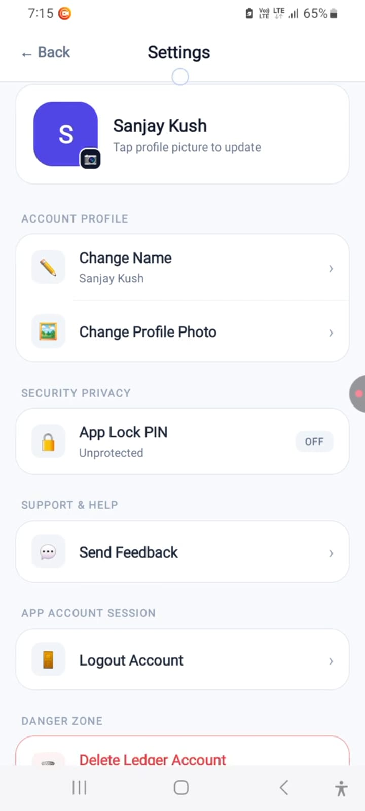
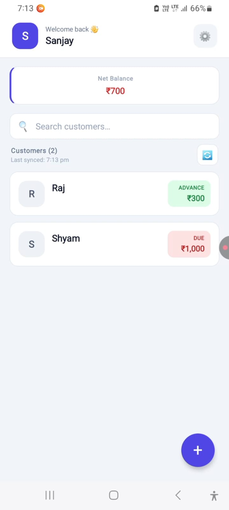
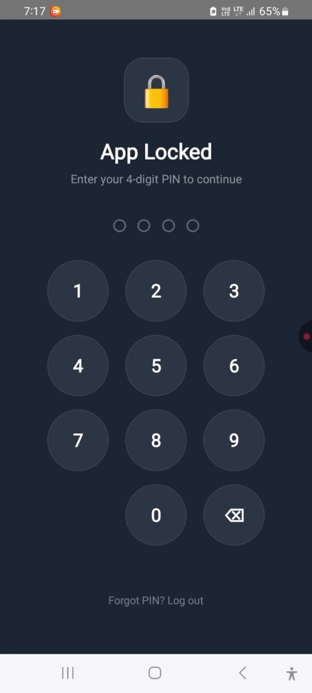

# 📒 Digital Ledger – Everyday Expense Manager

**Manage your transactions effortlessly.**

Digital Ledger is a digital khata app that replaces traditional paper ledger books for tracking day-to-day transactions between users and their customers. Shopkeepers, small business owners, and individuals can record credit (udhaar) and debit entries per customer, view clear per-customer transaction reports, and rest easy knowing their data is safely stored in the cloud.

---

## ✨ Features

### 🔐 Secure Onboarding & Authentication
- **Phone number login** with OTP verification — no passwords to remember.
- **Profile setup** with name and profile photo (skippable for now, editable later).
- **App Lock (PIN)** — an optional 4-digit PIN protects the app so only you can open it, with a "Forgot PIN?" recovery path.

### 👥 Customer Management
- **Add customers** quickly with name, phone number (optional), and address (optional).
- **Search customers** instantly from the home screen.
- Cloud sync with a visible **"Last synced"** timestamp, so data is protected against device loss.

### 💰 Transaction Tracking (Digital Khata)
- Record two kinds of entries per customer:
  - **+ Got Money** (green) — money you received from the customer.
  - **− Gave Money** (red) — money you gave (credit/udhaar).
- Add an **optional note (up to 200 characters)** to each transaction for future reference — e.g. "For books", "Loan for 5 days".
- Colour-coded timeline: green for credits, red for debits.

### 📊 Reports & Reconciliation
- **Per-customer ledger** with a clear transaction timeline (date, time, note, and amount for every entry).
- **Net Balance per customer** — shows the exact amount due or in advance, with a running balance on each entry (e.g. "Due ₹200" → "Settled").
- **Overall Net Balance** on the home screen, aggregated across all customers.
- Customer cards show **DUE** (red) or **ADVANCE** (green) badges at a glance for quick review.

### ⚙️ Settings & Account
- Change name and profile photo anytime.
- Enable/disable App Lock PIN.
- Send feedback to the developer.
- Logout and account deletion options.

---

## 🖼️ Screens Overview

| Screen | What it does |
|---|---|
| **Login** | Enter mobile number → get OTP → verify |
| **Welcome Aboard** | Set your display name |
| **Home** | Net balance, searchable customer list, sync status, add customer (FAB) |
| **Add Customer** | Name (required), phone & address (optional) |
| **Customer Ledger** | Net balance, full transaction timeline with notes, Got/Gave Money buttons, delete customer |
| **Money Received / Gave Money** | Enter amount + optional note for the transaction |
| **App Lock** | 4-digit PIN screen guarding the app |
| **Settings** | Profile, security, feedback, logout, delete account |

---

## 🎨 Highlights

- **Replaces paper khata books** — everything your notebook did, minus the risk of losing it.
- **Colour-coded balances** — red for dues, green for advances, so nothing slips through the cracks.
- **Cloud-based storage** — your ledger survives lost, damaged, or changed devices.
- **Notes on transactions** — context for every entry, exactly when you need it.
- **Lightweight & fast** — record a transaction in seconds.

---

## 🚀 Getting Started

1. Install the app and sign in with your mobile number.
2. Verify the OTP sent to your phone.
3. Enter your name (or skip).
4. Tap **+** to add your first customer.
5. Use **Got Money** / **Gave Money** to record transactions — and your digital khata is live!

> **Tip:** Turn on **App Lock PIN** from Settings → Security & Privacy to keep your ledger private.

---

## 🛠️ Tech Stack

- **Platform:** Android
- **Backend:** Cloud-based storage with real-time sync

---

## 🤝 Contributing

Contributions, issues, and feature requests are welcome! Feel free to open an issue or submit a pull request.

---

## 📬 Contact

Have suggestions or found a bug? Use **Send Feedback** in the app's Settings, or reach out via the repository's issue tracker.

---

## Screenshots
| Login Screen | Home Screen | Add Customer |
| --- | --- | --- |
|  |  |  |

| Customer Account | Add Transaction | Extra Options |
| --- | --- | --- |
|  |  |  |

| After Customer Added | App Lock |
| --- | --- |
|  |   |

